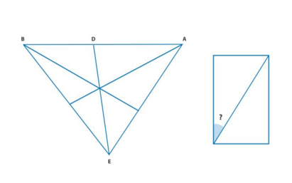
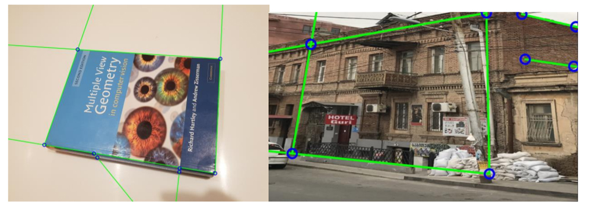
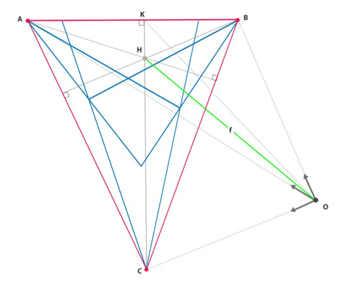
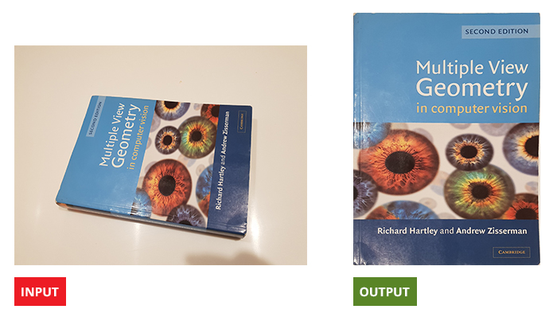

# Compute Intrinsics from Vanishing Points in Single Image
We want accurate ratio:

  

First, we find vanishing point:

  

Afterward, we calculate the focal length by vanishing points:

  

result 1:

  

result 2:

  

